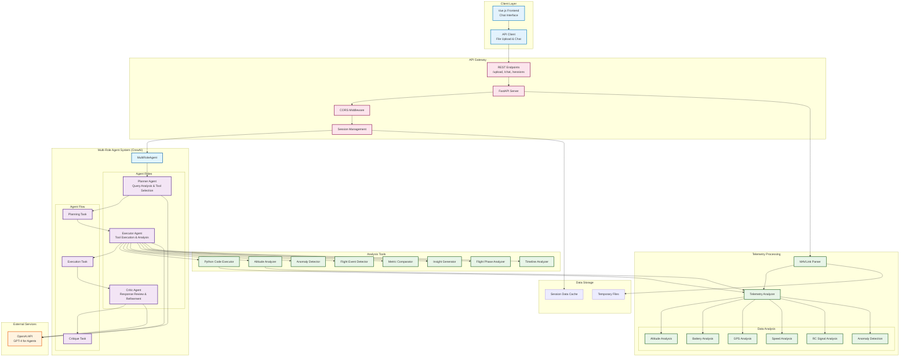

# UAV Log Viewer - Multi-Role Agentic Backend

A sophisticated AI-powered backend system for analyzing UAV (Unmanned Aerial Vehicle) telemetry data using advanced multi-role agentic AI architecture with CrewAI framework and intelligent reasoning capabilities.

## Overview

This backend provides intelligent analysis of MAVLink telemetry logs through a multi-role agentic AI system that can reason about flight data, detect anomalies, and provide detailed insights. The system features a **Planner → Executor → Critic** architecture, comprehensive telemetry analysis tools, and session-based conversation management.

### Key Features

- **Multi-Role AI System**: CrewAI-based architecture with Planner, Executor, and Critic agents
- **Advanced Analytics**: Comprehensive telemetry analysis with anomaly detection
- **Real-time Processing**: Asynchronous processing with session management
- **Secure API**: Session-based authentication with CORS protection
- **Comprehensive Metrics**: Flight statistics, battery analysis, GPS tracking, altitude analysis, and more
- **Dynamic Tool Selection**: Intelligent tool selection based on query analysis
- **Iterative Refinement**: Multi-agent collaboration for improved accuracy

## Architecture



## Prerequisites

- **Python 3.10+**
- **OpenAI API Key** (for multi-role agents)
- **Git** (for cloning the repository)

## Installation & Setup

### 1. Clone the Repository

```bash
git clone https://github.com/NeuralRevenant/UAVLogViewer.git
cd UAVLogViewer/backend
```

### 2. Create Virtual Environment

```bash
# Create virtual environment
python -m venv venv

# Activate virtual environment
# On macOS/Linux:
source venv/bin/activate
# On Windows:
venv\Scripts\activate
```

### 3. Install Dependencies

```bash
pip install -r requirements.txt

# Install CrewAI (if not in requirements.txt)
pip install crewai
```

### 4. Environment Configuration

Create a `.env` file in the backend directory:

```bash
# Copy example environment file
cp .env.example .env

# Or create a new .env file
touch .env
```

Add the following environment variables to your `.env` file:

```env
# OpenAI Configuration (Required)
OPENAI_API_KEY=your_openai_api_key_here
OPENAI_MODEL=gpt-4
MAX_TOKENS=1000
TEMPERATURE=0.3

# Server Configuration
HOST=0.0.0.0
PORT=8000

# CORS Configuration
CORS_ORIGINS=http://localhost:8080,http://localhost:3000,http://127.0.0.1:8080,http://localhost:8001

# Performance Configuration
USE_OPTIMIZED_PARSER=true
PARSER_MAX_WORKERS=0
```

### 5. Create Required Directories

```bash
mkdir -p temp
```

### 6. Start the Server

```bash
# Development mode with auto-reload
python main.py

# Or using uvicorn directly
uvicorn main:app --host 0.0.0.0 --port 8000 --reload
```

The server will start on `http://localhost:8000`

## API Endpoints

### Core Endpoints

#### `GET /health`
Health check and configuration status.

**Response:**
```json
{
    "status": "healthy",
    "openai_configured": true
}
```

#### `POST /sessions/upload-log`
Upload a MAVLink log file for analysis.

**Request:**
- **Content-Type**: `multipart/form-data`
- **Body**: MAVLink log file (.bin, .tlog or .log)

**Response:**
```json
{
    "session_id": "uuid-string",
    "message": "File upload successful, processing has started."
}
```

#### `POST /chat`
Send a message to the multi-role AI agent for analysis.

**Request:**
```json
{
    "message": "What was the highest altitude reached?",
    "session_id": "session-uuid"
}
```

**Response:**
```json
{
    "response": "The highest altitude reached was 120.5 meters at timestamp 00:08:45...",
    "session_id": "session-uuid",
    "conversation_count": 3
}
```

#### `GET /sessions/{session_id}`
Get session information and processing status.

**Response:**
```json
{
    "session_id": "session-uuid",
    "is_processing": false,
    "has_telemetry": true,
    "conversation_count": 3,
    "created_at": "2024-01-01T12:00:00Z"
}
```

#### `DELETE /sessions/{session_id}`
Clear session conversation history.

**Response:**
```json
{
    "message": "Session conversation history cleared successfully"
}
```

#### `GET /performance/stats`
Get overall performance statistics.

**Response:**
```json
{
    "total_sessions": 5,
    "total_llm_calls": 127,
    "average_response_time": 2.3,
    "total_cost_estimate": 0.45
}
```

#### `GET /performance/stats/{session_id}`
Get performance statistics for a specific session.

**Response:**
```json
{
    "session_id": "session-uuid",
    "llm_calls": 12,
    "total_cost": 0.08,
    "average_response_time": 1.8,
    "agent_performance": {
        "planner": {"calls": 4, "avg_time": 1.2},
        "executor": {"calls": 4, "avg_time": 2.1},
        "critic": {"calls": 4, "avg_time": 1.5}
    }
}
```

## Multi-Role Agent System

### CrewAI Architecture

The system uses a **Multi-Role Agent** approach with three specialized agents:

1. **Planner Agent**: 
   - Analyzes user queries and determines intent
   - Selects appropriate analysis tools
   - Creates execution plans with confidence scoring

2. **Executor Agent**: 
   - Executes selected tools with telemetry data
   - Performs parallel analysis when possible
   - Handles error recovery and fallbacks

3. **Critic Agent**: 
   - Reviews execution results for completeness
   - Refines responses for clarity and accuracy
   - Ensures conversational flow and context

### Agent Flow Examples

#### 1. Altitude Analysis Query
**User Query:** *"What was the maximum altitude during the flight?"*

**Agent Flow:**
```
→ Planner: Analyze query → Select [altitude_analyzer] tool → High confidence
→ Executor: Run altitude analysis → Extract max altitude and timestamp
→ Critic: Review response → Ensure clarity → Final answer delivered
```

#### 2. Comprehensive Anomaly Detection
**User Query:** *"Are there any issues I should be concerned about?"*

**Agent Flow:**
```
→ Planner: Broad safety inquiry → Select [find_anomalies, detect_flight_events] 
→ Executor: Run anomaly detection across all systems → Detect GPS and power events
→ Critic: Prioritize findings by severity → Conversational safety summary
```

#### 3. Flight Performance Summary
**User Query:** *"Give me a complete flight analysis"*

**Agent Flow:**
```
→ Planner: Comprehensive request → Select [generate_insights, analyze_flight_phase]
→ Executor: Generate complete flight metrics → Phase-by-phase analysis
→ Critic: Structure comprehensive report → Highlight key findings
```

### Available Analysis Tools

The agents have access to the following specialized tools:

- **`execute_python_code`**: Dynamic Python analysis for custom calculations
- **`analyze_altitude`**: Altitude statistics, peaks, and flight phases
- **`find_anomalies`**: Multi-system anomaly detection with severity scoring
- **`detect_flight_events`**: GPS loss, mode changes, critical alerts with timestamps
- **`compare_metrics`**: Statistical comparisons between different parameters
- **`generate_insights`**: Comprehensive flight performance and safety insights
- **`analyze_flight_phase`**: Takeoff, cruise, landing phase-specific analysis
- **`get_timeline_analysis`**: Chronological event sequencing and correlation

## Telemetry Analysis

### Supported Log Formats

- **MAVLink Binary Logs** (.bin) - Recommended
- **MAVLink Text Logs** (.log/.tlog)
- **ArduPilot DataFlash Logs** (.bin)

### Analysis Capabilities

#### Flight Metrics
- Altitude profiles, peaks, and phase transitions
- Speed analysis (ground, air, vertical, 3D velocity)
- Flight duration, distance, and trajectory analysis
- Takeoff and landing detection with performance metrics

#### Battery & Power Analysis
- Battery voltage curves and critical drops
- Current consumption patterns and peaks  
- Energy usage calculations and efficiency metrics
- Power system health indicators and warnings

#### GPS & Navigation Analysis
- GPS fix quality, accuracy, and satellite tracking
- Position drift analysis and consistency checks
- HDOP/VDOP metrics and precision indicators
- Navigation system performance and failures

#### System Health & Anomalies
- Statistical outlier detection across all systems
- Pattern recognition for unusual behavior
- Critical event identification and timeline correlation
- Multi-system failure analysis and impact assessment

## Configuration

### Environment Variables

| Variable | Default | Description |
|----------|---------|-------------|
| `OPENAI_API_KEY` | - | **Required**: OpenAI API key for multi-role agents |
| `OPENAI_MODEL` | `gpt-4` | OpenAI model for agent reasoning |
| `MAX_TOKENS` | `1000` | Maximum tokens per agent response |
| `TEMPERATURE` | `0.3` | Agent response creativity (0.0-1.0) |
| `HOST` | `0.0.0.0` | Server host address |
| `PORT` | `8000` | Server port |
| `CORS_ORIGINS` | `http://localhost:8080` | Allowed CORS origins |
| `USE_OPTIMIZED_PARSER` | `true` | Enable optimized log parsing |
| `PARSER_MAX_WORKERS` | `0` | Parser thread count (0 = auto) |

### Agent Configuration

- **Planning Confidence Threshold**: 0.7 (minimum confidence for tool selection)
- **Execution Timeout**: 30 seconds per tool
- **Critique Completeness Check**: Automatic response quality validation
- **Max Iterations**: 5 per agent role (with early stopping)
- **Tool Concurrency**: Parallel execution when possible

## Development

### Project Structure

```
backend/
├── main.py                     # FastAPI application and endpoints
├── config.py                   # Configuration management
├── models.py                   # Pydantic models and schemas
├── requirements.txt            # Python dependencies
├── .env                       # Environment variables
├── temp/                      # Temporary file uploads
├── agent/
│   ├── multi_role_agent.py    # Main CrewAI multi-role agent
│   └── chat_agent.py          # Legacy agent (compatibility)
├── tools/
│   ├── analysis_tools.py      # Core telemetry analysis tools
│   ├── tool_definitions.py    # OpenAI function calling schemas
│   ├── anomaly_detection.py   # Anomaly detection algorithms
│   ├── event_detection.py     # Flight event detection
│   ├── phase_analysis.py      # Flight phase analysis
│   ├── timeline_analysis.py   # Timeline and correlation analysis
│   └── insights_generator.py  # Flight insights generation
└── utils/
    ├── log_parser.py          # MAVLink log parsing utilities
    └── documentation.py       # Documentation and help tools
```

### Running in Development

```bash
# With auto-reload
python main.py

# With debug logging
PYTHONPATH=. python -m uvicorn main:app --reload --log-level debug

# With performance profiling
python -m cProfile -o profile.stats main.py
```

### Adding New Analysis Tools

1. **Create Tool Class** in `tools/` directory:
```python
class CustomAnalysisTool(BaseTool):
    name: str = "custom_analysis"
    description: str = "Description of what the tool does"
    
    def _run(self, parameters: str) -> str:
        # Tool implementation
        return "Analysis results"
```

2. **Add Tool Definition** in `tools/tool_definitions.py`:
```python
{
    "type": "function",
    "function": {
        "name": "custom_analysis",
        "description": "Tool description for LLM",
        "parameters": {
            "type": "object",
            "properties": {
                "param": {"type": "string", "description": "Parameter description"}
            },
            "required": ["param"]
        }
    }
}
```

3. **Register Tool** in `multi_role_agent.py` `_create_crew_tools()` method

## Security Features

- **Session isolation**: Each session maintains separate data and conversation history
- **Input validation**: Comprehensive request validation with Pydantic models
- **CORS protection**: Configurable origin restrictions for cross-origin requests
- **Error handling**: Graceful error responses without exposing internal details
- **Resource cleanup**: Automatic cleanup of temporary files and expired sessions
- **API rate limiting**: Built-in FastAPI request throttling

## Performance

### Optimization Features

- **Multi-agent parallelization**: Agents can run tools concurrently when possible
- **Optimized log parsing**: Memory-mapped file reading with efficient DataFrame creation
- **Session caching**: Reuse of parsed telemetry data across conversation turns
- **Async processing**: Non-blocking request handling with background tasks
- **Smart tool selection**: Planner agent avoids unnecessary tool executions

### Resource Usage

- **Memory**: ~50-200MB per active session (depending on log size)
- **CPU**: Burst usage during agent processing, idle between requests
- **Storage**: Temporary files automatically cleaned up after processing
- **OpenAI API**: ~500-2000 tokens per multi-role agent conversation

## Troubleshooting

### Common Issues

1. **OpenAI API Key Error**
   ```
   Error: OpenAI API key not found
   Solution: Set OPENAI_API_KEY in .env file
   ```

2. **CrewAI Import Error**
   ```
   Error: No module named 'crewai'
   Solution: pip install crewai
   ```

3. **Memory Issues with Large Logs**
   ```
   Error: Memory allocation failed during parsing
   Solution: Set USE_OPTIMIZED_PARSER=true or reduce log size
   ```

4. **Agent Timeout**
   ```
   Error: Agent execution timeout
   Solution: Increase timeout in agent configuration or simplify query
   ```

5. **Session Not Found**
   ```
   Error: Session ID not found
   Solution: Upload log file again or check session ID
   ```

### Logging

The system provides comprehensive logging for debugging:

```bash
# View real-time logs
tail -f logs/app.log

# Enable debug logging
export LOG_LEVEL=DEBUG
python main.py

# Agent-specific logging
grep "CrewAI\|multi-role" logs/app.log
```

## Contributing

1. Fork the repository
2. Create a feature branch: `git checkout -b feature/amazing-feature`
3. Commit changes: `git commit -m 'Add amazing feature'`
4. Push to branch: `git push origin feature/amazing-feature`
5. Open a Pull Request

## Acknowledgments & Technologies Used

* **MAVLink** –
  Lightweight messaging protocol for communicating with drones; used as the telemetry data standard for parsing `.bin/.tlog` files.

* **OpenAI (GPT-4)** –
  Powering all three agent roles (Planner, Executor, Critic) with advanced reasoning capabilities and tool selection intelligence.

* **CrewAI** –
  Multi-agent framework enabling sophisticated agent collaboration with role-based task distribution and iterative refinement.

* **FastAPI** –
  High-performance Python web framework powering the REST API with automatic documentation and async request handling.

* **pandas & numpy** –
  Core libraries for telemetry data processing, statistical analysis, and time-series calculations across all analysis tools.

* **scikit-learn** –
  Used for anomaly detection algorithms (IsolationForest) and statistical analysis in flight data validation.

* **Pydantic** –
  Data validation and serialization for API requests, responses, and agent communication schemas.

* **python-multipart** –
  Handling multipart file uploads for MAVLink log files in the FastAPI endpoints.

* **PyMAVLink** –
  Python implementation of the MAVLink protocol for parsing and interpreting ArduPilot telemetry messages.

* **HTTPX** –
  Async HTTP client for OpenAI API calls with retry logic and error handling.

* **python-dotenv** –
  Environment variable management for secure configuration loading.

* **Uvicorn** –
  ASGI server for running FastAPI with support for auto-reloading and high-performance request handling.

---

## Example Usage Scenarios

### Basic Flight Analysis
```bash
# 1. Upload log file
curl -X POST -F 'file=@flight_log.bin' http://localhost:8000/sessions/upload-log

# 2. Basic altitude query
curl -X POST http://localhost:8000/chat \
  -H "Content-Type: application/json" \
  -d '{"message": "What was the maximum altitude?", "session_id": "your-session-id"}'
```

### Advanced Multi-System Analysis
```bash
# Comprehensive flight safety analysis
curl -X POST http://localhost:8000/chat \
  -H "Content-Type: application/json" \
  -d '{"message": "Analyze the entire flight for any safety concerns, GPS issues, and power problems", "session_id": "your-session-id"}'
```

### Performance Monitoring
```bash
# Get agent performance stats
curl http://localhost:8000/performance/stats/your-session-id
```

This backend provides a robust foundation for UAV telemetry analysis with intelligent multi-role agent processing, comprehensive tool integration, and production-ready API endpoints. 